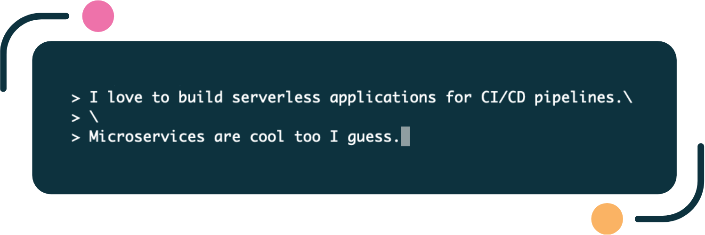

#### 
:wave: Craig's looking for his next challenge

##### 
[![Email][email]](mailto:craig.tubb.57@gmail.com "craig.tubb.57@gmail.com") [![LinkedIn][linkedin]](https://www.linkedin.com/in/craigtubb) [![Itch.io][itchio]](https://balroc.itch.io)

---

<!---
                                                                          TECHNOLOGIES
-->

<h3 align="middle">Recent tech</h3>

    
    
    
    
    
    
    
    
    
    
    

<h3 align="middle">AWS</h3>

    
    
    
    
    
    
    
    
    
    

    
    
    
    
    
    
    
    
    
    

<h3 align="middle">Other languages</h3>

    
    
    
    
    
    

<h3 align="middle">Infrastructure as Code</h3>

    
    
    

<h3 align="middle">Frameworks</h3>

    
    
    

<h3 align="middle">Data stores</h3>

    
    
    
    
    

<h3 align="middle">Other</h3>

    
    
    
    
    
    
    
    
    
    

---

<!---
                                                                            PRODUCTS
-->

<h3 align="middle">Products I've worked on</h3>

| Where | Product | Tech  | Impact
| :---------------------------------------------------------------------------------------------------------------------------------------------------------------------------------------------: | :-------------------------------------------------------------- | :-------------------------------------- | :--
|   | In-house market leading music publishing software.              | Java, Tomcat, Oracle                    | Led a team to implement stakeholder-driven features.
|                                                        | Driving telematics app for cheaper insurance                    | Ruby on Rails, Cassandra, Android, iOS  | Led a series of green field IoT projects & presented to executives.
|                  | The GitHub of research papers                                   | Java, DropWizard                        | Built scalable & concurrent-user REST APIs.
|                          | Bespoke holiday experiences & travel writing site               | Java, Spring Boot, Terraform, Kubernetes| Consulted on marketing tech & Agile practices.
|            | Cloud compliance product for Digital transformation consultancy | Python, AWS CodeSuite, serverless       | Transformed monolith prototype into serverless product.

---

<!---
                                                                        PERSONAL PROJECTS
-->

<h3 align="middle">Personal projects I'm slowly moving into public repos</h3>

| Name                                                            | Tech                                                                                                                                                                                                                                                                                                      | Purpose                                 | Status
| --------------------------------------------------------------: | :-------------------------------------------------------------------------------------------------------------------------------------------------------------------------------------------------------------------------------------------------------------------------------------------------------: | :-------------------------------------- | :----:
| [zappa-template](https://github.com/craigtubb57/zappa-template) |                                                                                | A project template                      | ![Ready][ready]
| pulumi-template                                                 |                                                                                    | Project template                        | ![Tidying][tidying]
| gm-template                                                     |                                                                                | Project template                        | ![Tidying][tidying]
| gh-pages-template                                               |                                                                             | Project template                        | ![Tidying][tidying]
| django-example                                                  |                                                                                | Example                                 | ![In Progress][inprogress]
| ez-auth                                                         |                                                                                            | Add authentication to a serverless app  | ![In Progress][inprogress]
| pistoleer                                                       |                                                                               | Library to manage simple data           | ![In Progress][inprogress]

  
Show more

| Name                                                            | Tech                                                                                                                                                                                                                                                                                                      | Purpose                                 | Status
| --------------------------------------------------------------: | :-------------------------------------------------------------------------------------------------------------------------------------------------------------------------------------------------------------------------------------------------------------------------------------------------------: | :-------------------------------------- | :----:
| flask-example                                                   |                                                                            | Example                                 | ![Todo][todo]
| troposphere-example                                             |                                                                                        | Example                                 | ![Todo][todo]
| py-util                                                         |                                                                                     | Utility functions                       | ![Todo][todo]
| imengine                                                        |                                                                                                                                                                                                                                                                                                           | Process images in a variety of ways     | ![Todo][todo]
| cloudformation-example                                          |  | Example                                 | ![Todo][todo]
| sam-example                                                     |                                                                                              | Example                                 | ![Todo][todo]
| terraform-example                                               |                                                                         | Example                                 | ![Todo][todo]
| react-example                                                   |                                                                                                          | Example                                 | ![Learn][learn]
| graphql-example                                                 |                                                                                                       | Example                                 | ![Learn][learn]

---

<!---
                                                                            GAME JAMS
-->

    I've been part of 3 GMTK Jam teams. Here's our 2023 entry:

    
    

---

<!---
                                                                            LEARNING
-->

<h3 align="middle">My current learning queue</h3>

    
    
    
    

---

<!---
                                                                          DISCOVERIES
-->

<h3 align="middle">Handy tools I've discovered recently</h3>

| Tool                                                                                                                                                                                                                                                                                        | Description                                     |
| :-----------------------------------------------------------------------------------------------------------------------------------------------------------------------------------------------------------------------------------------------------------------------------------------: | :---------------------------------------------- |
|  
Zed
                                                           | A nice code editor
| [![Grip][grip]](https://github.com/joeyespo/grip "Go to Github repo") 
Grip
                                                                                                                                                                                            | GitHub Readme Instant Preview in browser
|  
Troposphere
  | Generate AWS CloudFormation templates
|  
Pillow
                        | Python Imaging Library

---

<!---
                                                                            INTERESTS
-->

<h3 align="middle">I like Warhammer, other stuff, and also Warhammer</h3>

:tennis: Tennis

:video_game: Game Jams

:page_with_curl: Pub Quizzes

:dog: Walking my Jackapoo

:coffee: Great coffee

:beer: Real ale

:running: Running

---

#### 
Want to know more?

##### 
[![Email][email]](mailto:craig.tubb.57@gmail.com "craig.tubb.57@gmail.com") [![LinkedIn][linkedin]](https://www.linkedin.com/in/craigtubb)  [![Itch.io][itchio]](https://balroc.itch.io)

Byee! :wave:

[email]: https://img.shields.io/badge/Email-EA4335?style=for-the-badge&logo=gmail&logoColor=white
[linkedin]: https://img.shields.io/badge/LinkedIn-0077B5?style=for-the-badge&logo=linkedin&logoColor=white
[itchio]: https://img.shields.io/badge/Itch.io-F85C5B?style=for-the-badge&logo=itch.io&logoColor=white

[ready]: https://img.shields.io/badge/Ready-197D54?style=flat
[tidying]: https://img.shields.io/badge/Tidying-F68512?style=flat
[inprogress]: https://img.shields.io/badge/In%20Progress-F5C417?style=flat
[todo]: https://img.shields.io/badge/Todo-356ADE?style=flat
[learn]: https://img.shields.io/badge/Learn-5B7282?style=flat

[grip]: https://img.shields.io/badge/Grip-2F7BBC?style=for-the-badge
[rembg]: https://img.shields.io/badge/Rembg-FCBFFB?style=for-the-badge
